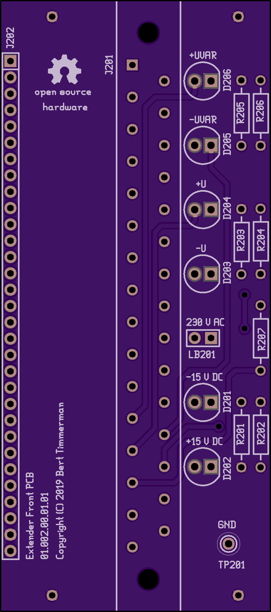
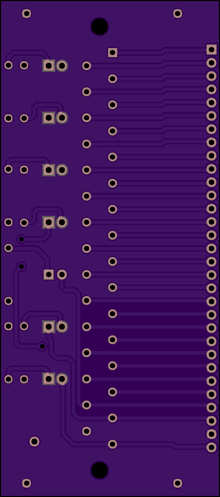
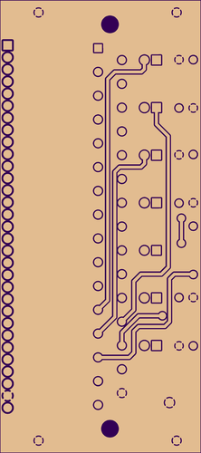

# 01.002.00.01.01 DO NOT USE !! (mirrored footprint)

Top.

Bottom.

## About your board

We detected a 2 layer board of 1.66 x 3.75 inches (42.2 x 95.2mm) 

3 boards will cost $31.15

Board name: 01.002.00.01.01

Description: Front PCB for Extender rev. 00

## Notes

Processing information

Processing [01-002-00.zip](01-002-00.zip) as generic ZIP file.

2 layer board of 1.66x3.75 inches.

Correcting drill zero suppression. Please verify drills align correctly. See help page. 

Your project contains 2 drill files, we've merged them. ["01.002.00.01.01.TXT", "01.002.00.01.01.XLN"]

Warning (non-critical)

Your project doesn't contain a bottom silk screen.

Uploaded: August 12th, 2019 19:39

Total price: $31.15 (3 pieces)

Previous orders: 

- August 14th, 2019 (SHIPPED).

# UNTESTED

## Bill Of Materials

refdes | value             | mfg       | mfg_PN                 | vendor | vendor_PN                                               | remarks |
-------|-------------------|-----------|------------------------|--------|---------------------------------------------------------|---------|
D201   | LED 6 mm Green    | Vishay    | TLLG5400               | Conrad | [186929](https://www.conrad.com/ce/en/product/186929)   |         |
D202   | LED 6 mm Green    | Vishay    | TLLG5400               | Conrad | [186929](https://www.conrad.com/ce/en/product/186929)   |         |
D203   | LED 6 mm Green    | Vishay    | TLLG5400               | Conrad | [186929](https://www.conrad.com/ce/en/product/186929)   |         |
D204   | LED 6 mm Green    | Vishay    | TLLG5400               | Conrad | [186929](https://www.conrad.com/ce/en/product/186929)   |         |
D205   | LED 6 mm Green    | Vishay    | TLLG5400               | Conrad | [186929](https://www.conrad.com/ce/en/product/186929)   |         |
D206   | LED 6 mm Green    | Vishay    | TLLG5400               | Conrad | [186929](https://www.conrad.com/ce/en/product/186929)   |         |
J201   | 31pin DIN41617    | Conec     | 102B10089X             | Conrad | [733109](https://www.conrad.com/ce/en/product/733109)   |         |
J202   | 31pin SIL 2.54 mm | W & P Products | 946-13-034-00     | Conrad | [737827](https://www.conrad.com/ce/en/product/737827)   | cut off 31 RA pins, use metallic parts only |
LB201  | neon bulb 230 V   | Barthelme | 00082305               | Conrad | [725200](https://www.conrad.com/ce/en/product/725200)   | insulate leads on top and bottom |
R201   | 680               | Yageo     | MF0207FTE52-680R       | Conrad | [1417659](https://www.conrad.com/ce/en/product/1417659) |         |
R202   | 680               | Yageo     | MF0207FTE52-680R       | Conrad | [1417659](https://www.conrad.com/ce/en/product/1417659) |         |
R203   | 1k                | Yageo     | MF0207FTE52-1K         | Conrad | [1417606](https://www.conrad.com/ce/en/product/1417606) |         |
R204   | 1k                | Yageo     | MF0207FTE52-1K         | Conrad | [1417606](https://www.conrad.com/ce/en/product/1417606) |         |
R205   | 1k5               | Yageo     | MF0207FTE52-1K5        | Conrad | [1417587](https://www.conrad.com/ce/en/product/1417587) |         |
R206   | 1k5               | Yageo     | MF0207FTE52-1K5        | Conrad | [1417587](https://www.conrad.com/ce/en/product/1417587) |         |
R207   | 270k              | Yageo     | MF0207FTE52-270K       | Conrad | [1417592](https://www.conrad.com/ce/en/product/1417592) |         |
TP201  | black             | Conrad    | TEST-1-BK              | Conrad | [407822](https://www.conrad.com/ce/en/product/407822)   |         |

# Verify your design

## Board Top

This shows the final manufactured board as if you held it in your hand.

Your design should show gold copper, purple mask, white silk, black drills, and the board outline.

Internal cutouts are indicated by a black outline but are not filled in.

If the image here is entirely white, you'll want to find and fix any gaps in the board outline.

There should be no dimension or measurement ruler.

## Board Bottom

This shows the final manufactured board as if you held it in your hand.

Your design should show gold copper, purple mask, white silk, black drills, and the board outline.

Internal cutouts are indicated by a black outline but are not filled in.

If the image here is entirely white, you'll want to find and fix any gaps in the board outline.

There should be no dimension or measurement ruler.

## Drills

Rendered from "01.002.00.01.01.TXT" , "01.002.00.01.01.XLN"

Drill files should be NC Drill or Excellon format files. Multiple files will be accepted, and merged into one for fabrication.

Drill hits that pass through copper will be plated. All other drill hits will be non-plated.

Most drill formats are detected and displayed as you'd see on the board. If your drills look incorrect, try exporting with INCH units and either No Zero Suppression or Leading Zero Suppression.

Drill slots and "oval" drills included as part of the drill file are supported. Most design tools do this when using the tool's native slot commands. Supported slots will appear on this preview. 
Note, it's possible to use this supported callout in an unsupported way. See our Cutouts and Slots page for details regarding unsupported applications of slot drill commands.

Drills sizes below our minimums will be increased to the minimum size. See the design rules or our drills help page. for additional details on drill specs. 

Additionally, the following are not supported:

- No overlapping drill hits.

- No blind or buried vias.

## Board Outline

Rendered from "01.002.00.01.01.GKO"

The board outline should be a watertight (no gaps) purple outline showing at least the edge of the board with no gaps.

We will cut non-rectangular board shapes, but you will be billed for the smallest rectangle that will encompass the design.

As an example, a 2in diameter circle is billed the same as a 2in by 2in square.

Non-plated Board Cutouts can be represented on the board outline layer, with some limitations.

Slots are unsupported when indicated on the board outline layer, but usually work. To make slots with full support, use Drill Slots on the drill layer.

## Top Solder Mask

Rendered from "01.002.00.01.01.GTS"

Soldermask layers show us where to remove the purple solder resist. The gold-colored areas will be exposed on the final board, and purple areas will be covered.

If you submitted an empty file, we won't remove any mask so this entire side of the board will be covered in purple soldermask.

To expose the entire board, submit this file with a single polygon that covers the entire board. We will remove all mask everywhere and expose all the copper and board substrate.

## Bottom Solder Mask

Rendered from "01.002.00.01.01.GBS"

This layer should appear 'mirrored' as if you were looking down on it through the board from the top.

Soldermask layers show us where to remove the purple solder resist. The gold-colored areas will be exposed on the final board, and purple areas will be covered.

If you submitted an empty file, we won't remove any mask so this entire side of the board will be covered in purple soldermask.

To expose the entire board, submit this file with a single polygon that covers the entire board. We will remove all mask everywhere and expose all the copper and board substrate.

## Top Silk Screen

Rendered from "01.002.00.01.01.GTO"

We will ignore the portion of the silkscreen that extends beyond the board outline.

We will automatically remove any silkscreen that crosses drilled holes or exposed copper.

If a logo isn't showing up on this layer, try changing your design tool import settings to create that silk image with 400 DPI or less, or check out our [Eagle-specific import-bmp script]((http://docs.oshpark.com/troubleshooting/import-bmp/)) instructions.

## Top Layer

Rendered from "01.002.00.01.01.GTL"

We will place copper everywhere we see gold color on this layer.

If you are using Altium Designer or Altium CircuitMaker, carefully examine the board to make sure there are no shorts from the mechanical layers being included on this layer. See [here](http://docs.oshpark.com/design-tools/altium-designer/) for more.

If you are using Eagle, be aware that airwires are not the same as routed traces. If there are no copper links between pads showing on this layer, please review your .brd file for airwires.

See our [design tools pages](http://docs.oshpark.com/design-tools/) for more.

## Bottom Layer

Rendered from "01.002.00.01.01.GBL"

This layer should appear 'mirrored' as if you were looking down on it through the board from the top.

We will place copper everywhere we see gold color on this layer.

If you are using Altium Designer or Altium CircuitMaker, carefully examine the board to make sure there are no shorts from the mechanical layers being included on this layer. See [here](http://docs.oshpark.com/design-tools/altium-designer/) for more.

If you are using Eagle, be aware that airwires are not the same as routed traces. If there are no copper links between pads showing on this layer, please review your .brd file for airwires.

See our [design tools pages](http://docs.oshpark.com/design-tools/) for more.

